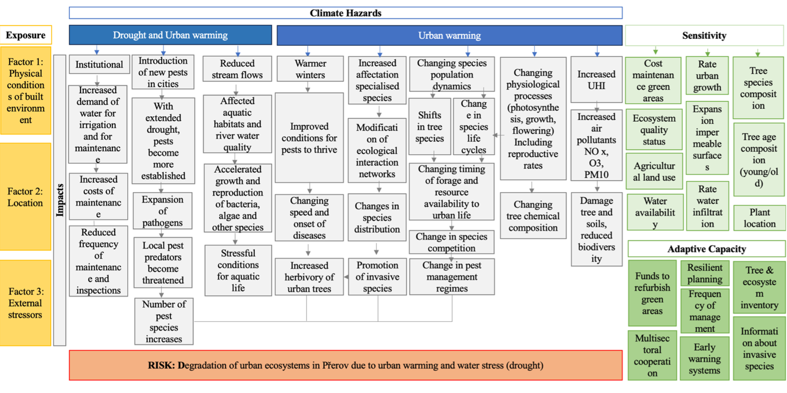

# Climate-Impact-Chains
This repository outlines each of the Climate Impact Chains developed in the course of the VALORADA project.

# Climate Impact Chains
Risks associated with climate change are often analysed in isolation, focusing only on specific economic sectors or ecosystems. However, this narrow approach can miss indirect impacts, risks of maladaptation and feedback loops. 
A climate-impact chain describes the relationship between a particular climate hazard and its impact on a specific area of influence, thereby helping identify cause-effect relationships between different components within a system. 

# Five climate impact chains and their respective hazards are displayed:

* Degradation of urban ecosystems due to urban heat and droughts -	**High temperature and Drought**
* Extreme high temperatures on people’s health in the context of urban transport -	**High temperature**
* Drought affecting agricultural production and rural livelihoods -	**Drought**
* Wildfire affecting infrastructure	- **High temperature and Drought**
* Floods affecting rural livelihoods -	**Extreme precipitation**

# Climate Impact Chains (CICs) in VALORADA
The Climate Impact Chains (CICs) were co-developed with stakeholders from VALORADA’s demonstrator regions, ensuring validation against real-world contexts. While CICs serve as a generic framework for exploring climate risks, they are also illustrated with concrete examples from the demonstrator regions, reinforcing their practical relevance and applicability.

# Exploring Climate Impact Chains
Each Climate Impact Chain includes a detailed explanation of its sequences, allowing readers to examine the potential implications of the identified risk factors. To support practical understanding, illustrative examples of policy challenges associated with each chain are provided. While not exhaustive, these examples highlight key issues and serve as a starting point for further exploration.  

# Climate Impact Chain 1. 
**Main Risk: Degradation of urban ecosystems due to urban heat and droughts.** 

**Key Policy Issues:**
* Urban heat island effect and drought degrading urban green spaces.
* Loss of ecosystem services (temperature control, green areas for social activities).
* Introduction of foreign pests and changes in plant-disease patterns.
* Stress on aquatic life and changes in species distribution.
* Need for resilient urban planning, increased green infrastructure, and improved ecosystem monitoring.
* Addressing social vulnerability, especially for elderly and health-compromised populations.

**Sequence 1. Institutional impacts**
In the first sequence of impacts proposed, the focus is on the reduced capacity to keep appropriate and frequent maintenance and inspection to degrading urban ecosystems provoked by urban heat, warming and droughts. The proposed impact factors in this first sequence emerge as propositions provided by the participants during the workshop. The cause-effect relationships are presented below. 

**Sequence 2: Expansion of pests and pathogens**
In the second sequence of impacts proposed, the focus is on the expansion of pests and pathogens provoked by urban heat, warming and droughts. Literature supporting the statements as well as suggestions connecting the cause-effect relationship are presented below.

 

**Sequence 3: Drought and urban heat on river ecosystems**
In the third sequence of impacts proposed, the focus is on the degradation of aquatic habitats provoked by urban heat, warming and droughts. Literature supporting the statements as well as suggestions connecting the cause-effect relationship are presented below.

**Sequence 4: Urban heat on pests and tree degradation**
In the fourth sequence of impacts proposed, the focus is on expansion of new pests and tree degradation provoked by urban heat and warming. Literature supporting the statements as well as suggestions connecting the cause-effect relationship are presented below.

**Sequence 5: Urban heat on the promotion of invasive species**
In the fifth sequence of impacts proposed, the focus is on the affectation of specialised species and the promotion of invasive species degradation provoked by urban heat and warming. Literature supporting the statements as well as suggestions connecting the cause-effect relationship are presented below.

**Sequence 6: Urban heat on population dynamics and forage availability**
In the sixth sequence of impacts proposed, the focus is on the changing population dynamics and forage availability provoked by extreme heat. Literature supporting the statements as well as suggestions connecting the cause-effect relationship are presented below.

**Sequence 7: Urban heat on physiology**
In the seventh sequence of impacts proposed, the focus is on plant physiological impacts provoked by urban heat and warming. Literature supporting the statements as well as suggestions connecting the cause-effect relationship are presented below.

**Sequence 8: Heat on air pollution**
In the eighth sequence of impacts proposed, the focus is on the degradation of urban ecosystems due to increasing levels of air pollution as provoked by urban heat and warming. Literature supporting the statements as well as suggestions connecting the cause-effect relationship are presented below.

# Climate Impact Change 2. 
**Main risk: Heat affecting people’s health: transport and deterioration of social and environmental determinants of health**

**Key Policy Issues:**
*	Heat stress and accidents in urban mobility (public transport, cycling, walking).
*	Infrastructure overheating (roads, vehicles).
*	Vulnerability of elderly, children, and those with pre-existing health conditions.
*	Need for early warning systems, public health interventions, and resilient transport infrastructure.

**Sequence 1.** 
In the first sequence of impacts proposed, the focus is on the increase of air pollution as provoked by urban warming and related health effects. Literature supporting the statements as well as suggestions connecting the cause-effect relationship are presented below. 

**Sequence 2.  People’s health being affected by the increased temperatures in their private households.**

**Sequence 3.**
In the third sequence of impacts proposed, the focus is on the affectation on people’s health and on the reduction of people’s productivity while working due to increase temperature.

**Sequence 4.**
In the fourth sequence, the focus is on people’s health as being affected by the increased risk of car, bike, and pedestrian accident due to mental stress and reduced performance of infrastructure. This sequence of impacts includes also the pressure exerted on the capacity of operators to keep pace with worsening infrastructure.

**Sequence 5. Risks linked to mobility**
In the fifth sequence of impacts proposed, the focus is on the risk of accidents as people are affected by physical discomfort and mental stress while driving and commuting due to high temperatures, resulting in more risky behaviour. Literature supporting the statements as well as suggestions connecting the cause-effect relationship are presented in figure 5, below.

**Sequence 6: Reduced water availability affecting urban ecosystems and economic activities.**

**Sequence 7. Drought and urban heat on river ecosystems**
In the seventh sequence of impacts proposed, the focus is on the degradation of aquatic habitats provoked by urban heat, warming and droughts.

**Sequence 8: Ecosystem degradation**
In the eighth sequence of impacts proposed, the focus is on the degradation of urban ecosystems due to extreme temperatures and the loss of cooling spaces for people during extreme heat. 

**Sequence 9: Urban heat on ecosystem population dynamics and forage availability**
In the nineth sequence of impacts proposed, the focus is on the changing population dynamics and forage availability provoked by extreme heat. 

**Sequence 10: Increased water- and food-borne disease**
In the tenth sequence of impacts proposed, the focus is on the shifting the environmental suitability for the transmission of various infectious diseases due to extreme temperatures.

# Climate Impact chain 3: 
**Main Risk: Drought affecting agricultural production and rural livelihoods**

**Key Policy Issues:**
*	Water scarcity and conflicts over water use (irrigation, domestic, industrial).
*	Soil erosion, salinisation, and land degradation.
*	Declining agricultural productivity and risk to rural livelihoods.
*	Need for sustainable water management, support for farmers, and ecosystem restoration.

**Sequence 1.**  
In the first sequence, the focus is on increased affectation of plant specialised species due to increasing temperatures and the resulting increased risks of new pests and diseases affecting livestock and agricultural production.

 

**Sequence 2.**  
In the second sequence, the focus is on the combined effects of high T and evapotranspiration in connection with agricultural droughts impacting soil erosion and reducing food production.
 

**Sequence 3.**
In the third sequence, the focus is on the effects provoked by both, agricultural and meteorological droughts on water restrictions on reduced quantity of fodder for livestock. 

**Sequence 4.**  
In the fourth sequence, the focus is on the impact of droughts on rural livelihoods.

 

**Sequence 5.**
In the fifth sequence, the focus is on the effects of hydrological droughts on the accelerated growth and reproduction of bacteria, algae and other species which affects aquatic ecosystems.

 
# Climate Impact Chain 4: 
**Main risk: Drought and heat increasing the risk of wildfire**

**Key Policy Issues:**
*	Wildfire risk due to high temperatures, drought, and poor forest management.
*	Increased fuel load from storms and lack of forest maintenance.
*	Intensive tourism increasing fire risk.
*	Need for integrated forest management, wildfire prevention, and flood resilience.

**Sequence 1.  Contrasting patterns of seasonal extremes events**
In the first sequence of impacts proposed, the focus is on the effects provoked by seasonal extreme events (extreme precipitation followed by drought and extreme temperatures) on the generation of fuels. 

 
**Sequence 2. Increased drought and temperature**
 

**Sequence 3. Forestry practices**
In the third sequence of impacts proposed, the focus is on the negative effect that poor forestry practices provoke by increasing the accumulation of burnable biomass.

**Sequence 4. Farming practices**
In the fourth sequence of impacts proposed, the focus is on the higher chance of fire ignition due to human negligence linked to poor farming practices.
 

**Sequence 5. Rural-Urban migration**
In the fifth sequence of impacts proposed, the focus is on the higher risk of fire ignition linked to abandoned rural lands due to urban migration. This sequence is connected to sequence 7, as far as migration and reduced economic activity are closely linked together, enhancing the likelihood of wildfires through increased amounts of burnable biomass, and further affecting local economy and need to migrate.
 

**Sequence 6. Tourism**
In the sixth sequence of impacts proposed, the focus is on the higher risk of fire propagation linked to the increased demand for holidays housing and the use of light material for their construction, as well as due to closeness to wildfire-risk-prone areas.
This sequence is connected to sequence 7, as far as tourism is disrupted in the short term due to wildfires and smokes, as well as in the long term due to loss of ecosystem services that make a touristic destination to be attractive. 

 

**Sequence 7. Socio-economic and ecological impacts**
  

# Climate Impact chain 5: 
**Main Risk: Floods affecting rural livelihoods.**

**Key Policy Issues:**
*	Flooding of agricultural land and rural infrastructure.
*	Risk of dam failure and chemical contamination from industrial sites.
*	Outmigration and reduced rural governance, increasing fire and hydrogeological risks.
*	Need for robust flood management, infrastructure resilience, and rural development policies.

**Sequence 1.  Hydrogeological events impact public infrastructure**
In the first sequence of impacts proposed, the focus is on how hydrogeological events affect the dissemination of chemical pollutants., as extreme rainfall provokes water running off and inundating industrial areas, spreading chemical pollutants to nearby agricultural lands. 
 

**Sequence 2.  Interruption of public services**
In the second sequence of impacts proposed, the focus is on the affectation provoked by hydrogeological events on roads. The proposed impact factors in this first sequence emerge as propositions provided by the participants during the workshop. 

 

**Sequence 3.  Soil degradation and reduced productivity**
In the third sequence of impacts proposed, the focus is on the affectation provoked by hydrogeological events on soil degradation and associated reduced productivity. 

 

**Sequence 4.  Affectation of hydrogeological events on demographic trends and land uses**
In the third sequence of impacts proposed, the focus is on the affectation provoked by hydrogeological events on demographic trends and land uses.  

 

